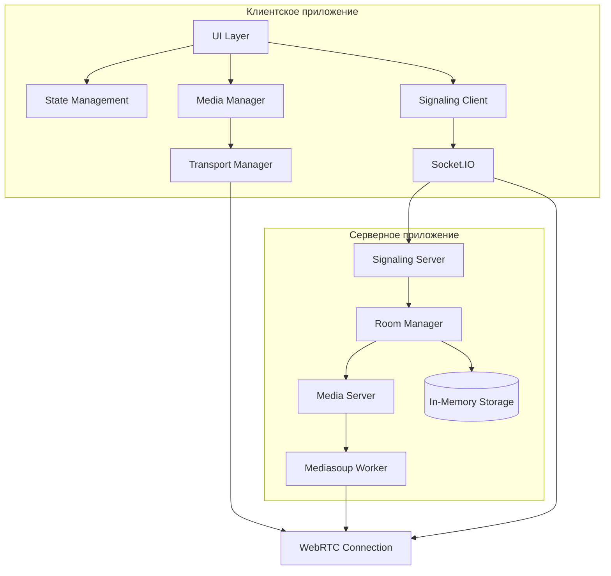

# StreamChansky

Web-service for live streaming and voice chatting.
## Диаграмма архитектуры (Mermaid)

```mermaid
graph TB
    subgraph "Клиентское приложение"
        UI[UI Layer] --> State[State Management]
        UI --> Media[Media Manager]
        UI --> Signaling[Signaling Client]
        Media --> Transport[Transport Manager]
        Signaling --> Socket[Socket.IO]
    end

    subgraph "Серверное приложение"
        Socket --> SignalingServer[Signaling Server]
        SignalingServer --> RoomManager[Room Manager]
        RoomManager --> MediaServer[Media Server]
        MediaServer --> Mediasoup[Mediasoup Worker]
        RoomManager --> Storage[(In-Memory Storage)]
    end

    Socket --> WebRTC[WebRTC Connection]
    Transport --> WebRTC
    Mediasoup --> WebRTC
```
